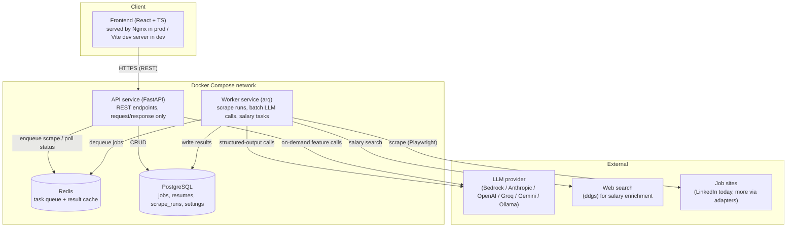
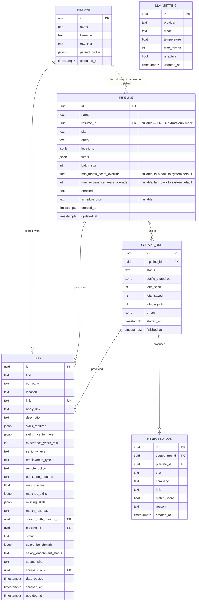

# Architecture — v2

Status: Draft v1
Companion docs: [functional-requirements.md](functional-requirements.md), [system-design.md](system-design.md), [flow-diagrams.md](flow-diagrams.md), [plan.md](plan.md)

## 1. Tech stack decisions

| Layer | v1 | v2 | Rationale |
|---|---|---|---|
| Backend language | Python | Python (unchanged) | LLM tooling (LangChain/LangGraph-optional), scraping ecosystem, and existing feature code are Python; user asked to change the frontend language, not the backend. |
| API framework | FastAPI | FastAPI (unchanged) | Already proven in v1; async-native fits the worker/queue model. |
| Database | SQLite | **PostgreSQL** | v1's SQLite cannot safely handle concurrent writers (API process + worker process + parallel salary tasks). Postgres is the standard choice for a Dockerized multi-service backend and gives us real migrations, indexing, and JSONB for flexible fields. |
| Task queue / broker | none (in-process threads + LangGraph) | **Redis + a lightweight task queue (arq)** | The design explicitly requires parallel background work (salary lookups) and a long-running scrape pipeline that must not block API requests. arq is chosen over Celery for a single-user local deployment: it's asyncio-native (matches FastAPI), far less operational overhead (no separate result backend, no Celery beat, no multiple queue types to reason about), and Redis is a single extra container we already want as a cache. Celery remains an option if the project later grows multi-user. |
| Browser automation | `linkedin-jobs-scraper` (Selenium-based 3rd-party lib) | **Playwright**, first-party adapter code | The 3rd-party library ties us to its own selector maintenance (the `date_posted` capture bug found in v1 lives entirely inside that library). Owning the adapter code directly is what "universal scraper, ability to add new scrapers" actually requires — you cannot build a clean adapter interface on top of a library that only knows how to scrape one site. Playwright also has first-class Docker support and is materially faster/more stable than Selenium for this kind of DOM scraping. |
| LLM orchestration | LangChain + LangGraph (4-node graph) | **LangChain only** (structured output calls), no LangGraph | The v1 graph (scraper → {jd_parser, resume_parser} → matcher) existed to coordinate a *multi-pass* pipeline. v2's core flow is a straight-line batch loop (scrape batch → one structured-output LLM call → filter → save → dispatch background task) — a plain async function expresses this more simply than a graph framework. LangGraph is not ruled out permanently; if a future feature needs branching/looping agent behavior, it can be reintroduced there specifically. |
| Semantic matching model | sentence-transformers (`all-MiniLM-L6-v2`) + sklearn cosine similarity | removed | Matching becomes part of the single LLM's structured-output response (FR-2.2), so a separate embedding model and its cache (`diskcache`) are no longer needed for the core flow. |
| Frontend | Streamlit | **React + TypeScript (Vite)** | Explicit requirement. |
| Frontend state/data | Streamlit session state | TanStack Query (server state) + Zustand (light UI state) | Standard, well-understood pairing; TanStack Query gives caching/retry/loading-state handling essentially for free, which the current hand-written `api_client.py` + `st.session_state` juggling does manually and inconsistently. |
| Frontend styling | Streamlit defaults | Tailwind CSS + shadcn/ui | Fast to build a real design with, accessible primitives out of the box. |
| API client (frontend) | hand-written `httpx` wrapper | generated from FastAPI's OpenAPI schema (`openapi-typescript`) | Removes an entire class of drift bugs where the client and the API silently disagree on shape. |
| Containerization | Two Dockerfiles, no compose orchestration of internal services | **Docker Compose**: `api`, `worker`, `frontend`, `postgres`, `redis` | FR-9. |
| Migrations | none (`Base.metadata.create_all`) | **Alembic** | Required once on Postgres in a system meant to evolve; v1's schema-on-boot approach doesn't support safe column changes. |

## 2. High-level architecture



**Why the API/worker split, given this is single-user and local:** a scrape run is minutes long and involves a real browser; an on-demand feature call is a few seconds. If both ran in the same process handling HTTP requests, a scrape run would starve the API (or vice versa, matching v1's actual failure mode: it was a single FastAPI process doing everything, so a slow LLM call blocked the health check and the UI froze). Splitting them into separate containers means the API stays responsive while a scrape run and its salary-enrichment fan-out proceed independently — this is the direct fix for the reliability problems v1 was asked to move away from.

## 3. Low-level design

### 3.1 Backend module layout

```
v2/backend/
  app/
    main.py                  # FastAPI app, lifespan, router registration
    api/
      routes/
        jobs.py               # list/get/status/delete/bulk-delete-by-date, filter by pipeline_id
        scrape.py             # trigger run (by pipeline_id), get run status, list runs
        resumes.py            # resume library: upload/list/delete (no "active" concept)
        pipelines.py           # pipeline CRUD: name, resume_id, site, query, filters, thresholds
        features.py           # on-demand: cover-letter, ats-score, interview-prep,
                                # company-intel, resume-improve, career-path
        settings.py           # get/set the single active LLM config (global, not per-pipeline)
      dependencies.py          # DB session, repo, settings providers
      schemas/                 # Pydantic request/response models (mirrors v1 api/models.py)
    core/
      config.py                 # env-driven app config (DB url, redis url, secrets)
      llm.py                    # single LLM factory — carries over the Bedrock
                                 # Converse-API fix from v1's config/llm_factory.py
      logging.py
    domain/
      models.py                 # SQLAlchemy ORM: Job, Resume, Pipeline, ScrapeRun, RejectedJob, LLMSetting
      repository.py             # async repository, mirrors v1's db/repository.py patterns
      migrations/                # Alembic
    scrapers/
      base.py                    # BaseScraper interface (query in, RawJob batches out)
      registry.py                 # site-name -> scraper class
      linkedin/
        adapter.py                 # Playwright-based LinkedIn adapter
        selectors.py                # isolated, versioned selector constants
      # future: indeed/, naukri/, ...
    llm_tasks/
      batch_extract.py            # the single structured-output call: extraction + filter + match
      schemas.py                  # Pydantic: BatchJobAnalysis, JobAnalysisResult
      prompts.py
      features/                    # ported from v1 features/*.py, now single-LLM
        cover_letter.py
        ats_scorer.py
        interview_prep.py
        company_intel.py
        resume_improver.py
        career_path.py
    services/
      scrape_service.py            # orchestrates: adapter -> batches -> llm_tasks -> filter -> save -> enqueue salary
      salary_service.py            # web search + LLM synthesis, called by worker task
      feature_service.py           # thin layer api routes call into for on-demand features
    workers/
      worker_app.py                 # arq worker entrypoint, cron for scheduled scrapes
      tasks.py                      # run_scrape_task, salary_lookup_task
  tests/
  Dockerfile
  Dockerfile.worker
  pyproject.toml
```

### 3.2 Data model (Postgres)



Notes:
- `date_posted` becomes a real `timestamptz`, not free text — the site adapter is responsible for normalizing whatever the source site gives it (fixing the class of bug found in v1 at the adapter boundary instead of downstream).
- `REJECTED_JOB` implements FR-2.3's "lightweight rejection record" — enough to audit filter behavior without paying full storage/enrichment cost for jobs that didn't pass.
- `PIPELINE` replaces v1's single global `config.yaml` `queries:` section (and this doc's earlier draft `SCRAPER_CONFIG`) with one or more independently runnable, resume-bound rows — this is what makes "an AI Engineer pipeline and a Data Engineer pipeline, each with their own resume, running independently" (FR-1A) a first-class concept instead of a single global setting.
- `RESUME` drops v1's `is_active` boolean entirely — there is no single active resume in v2; a resume is simply "in the library," and whichever pipeline(s) reference it via `PIPELINE.resume_id` use it. `RESUME.name` is new (a short user-given label like "AI Engineer" or "Data Engineer") since multiple resumes now need to be distinguishable in the UI.
- `JOB.pipeline_id` (denormalized alongside `scrape_run_id`, which already implies a pipeline via `SCRAPE_RUN.pipeline_id`) exists specifically so the UI can filter "jobs from the Data Engineer pipeline" with a simple indexed column instead of a join (FR-1A.6).
- `LLM_SETTING` (single active row) moves v1's `.env`-only LLM config into the database so the UI can change it at runtime (FR-3.2) — this one stays global/singular by design (one LLM for everything, per FR-3.1), unlike resumes/pipelines which are explicitly multi.

### 3.3 Core interfaces (illustrative signatures)

```python
# scrapers/base.py
class RawJob(BaseModel):
    title: str
    company: str
    location: str | None
    link: str
    apply_link: str | None
    description: str
    date_posted_raw: str | None      # adapter's raw string
    date_posted: datetime | None      # adapter's best-effort normalized value

class BaseScraper(Protocol):
    site_name: str
    async def scrape(self, pipeline: Pipeline) -> AsyncIterator[list[RawJob]]:
        """Yields batches of `pipeline.batch_size` RawJob (last batch may be smaller)."""

# llm_tasks/schemas.py
class JobAnalysisResult(BaseModel):
    job_index: int                    # position within the batch, for reassembly
    skills_required: list[str]
    skills_nice_to_have: list[str]
    experience_years_min: int | None
    seniority_level: str | None
    employment_type: str | None
    remote_policy: str | None
    education_required: str | None
    salary_hint: str | None
    match_score: float                 # 0..1, LLM's assessment
    matched_skills: list[str]
    missing_skills: list[str]
    match_rationale: str

class BatchJobAnalysis(BaseModel):
    results: list[JobAnalysisResult]

# llm_tasks/batch_extract.py
async def analyze_batch(
    jobs: list[RawJob], resume_text: str, llm: BaseChatModel
) -> BatchJobAnalysis: ...

# services/scrape_service.py
async def run_scrape(pipeline: Pipeline) -> ScrapeRunResult:
    """
    resume = await repo.get_resume(pipeline.resume_id) if pipeline.resume_id else None
    thresholds = pipeline.effective_thresholds()   # override, else system default

    For each batch from the adapter (adapter is chosen by pipeline.site via registry.py):
      1. analysis = await analyze_batch(batch, resume.raw_text if resume else "", get_active_llm())
      2. for each (raw_job, result): apply deterministic threshold check against `thresholds` (FR-2.4)
      3. passing jobs -> upsert to DB tagged with pipeline_id + scored_with_resume_id, enqueue salary_lookup_task
      4. failing jobs -> increment jobs_rejected, optionally write RejectedJob tagged with pipeline_id

    Two pipelines calling run_scrape() concurrently are independent except for the
    shared LLM concurrency semaphore in core/llm.py (system-design.md §2.3/FR-1A.5).
    """
```

### 3.4 API surface (delta from v1, same REST style)

- `GET/POST /scrape` (body: `pipeline_id`), `GET /scrape/{run_id}`, `GET /scrape/runs?pipeline_id=` — unchanged in spirit, now pipeline-scoped.
- `GET /jobs` (gains `pipeline_id` filter), `GET /jobs/{id}`, `PATCH /jobs/{id}/status`, `DELETE /jobs/{id}`, `DELETE /jobs?before_date=`, `GET /jobs/count-before` — carried over as-is (the bulk-delete-by-date feature just shipped in v1 ports directly; `before_date` filtering composes with the new `pipeline_id` filter).
- `GET/PUT /settings/llm` — read/update the single active `LLM_SETTING` row (FR-3.2) — stays global, not pipeline-scoped.
- `GET/POST/PUT/DELETE /resumes` — new: manage the resume library (FR-1A.2). `DELETE` is rejected (409) if any enabled pipeline still references the resume (FR-1A.7).
- `GET/POST/PUT/DELETE /pipelines` — new: manage `PIPELINE` rows (replaces both v1's `config.yaml` `queries:` section and this doc's earlier single-`scrapers` settings draft).
- `POST /features/{feature}/{job_id}` — unchanged in spirit, always uses the single active LLM (no `model`/`provider` query overrides — FR-3.1) and defaults to the job's own `scored_with_resume_id` (FR-1A.8) rather than asking which resume to use.

## 4. Future extension points (explicitly deferred, not designed in detail now)

- Auth/multi-tenancy: `LLM_SETTING`/`PIPELINE`/`RESUME` would gain a `user_id` FK; API would gain an auth dependency. Nothing in the v2.1 schema actively conflicts with adding this later.
- Additional scraper adapters (Indeed, Naukri, Wellfound): implement `BaseScraper`, register in `registry.py`, add a `PIPELINE.site` value — no other code changes required per FR-1.3. Existing pipelines are unaffected; a user simply creates a new pipeline pointing at the new site.
- Horizontal scaling: arq workers are already separate processes; scaling to N worker replicas needs no code change, only compose/deployment config. This is also what lets multiple pipelines' scrape runs genuinely overlap in wall-clock time rather than queueing behind each other.
