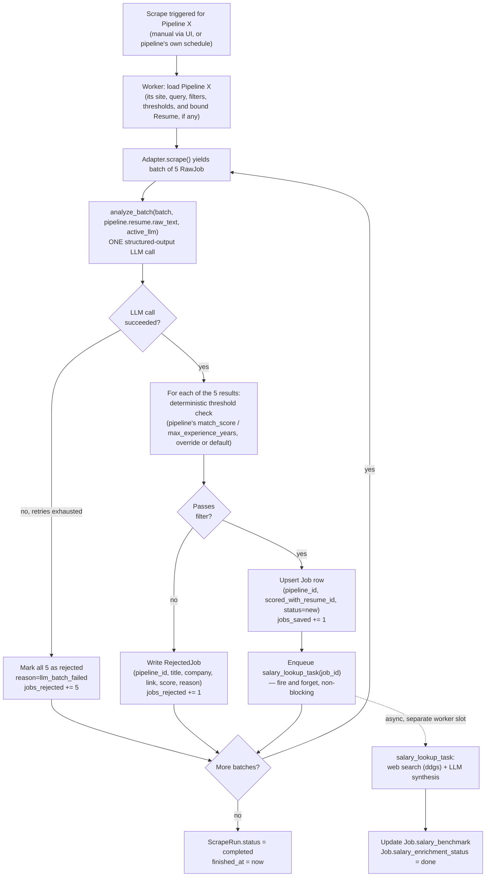
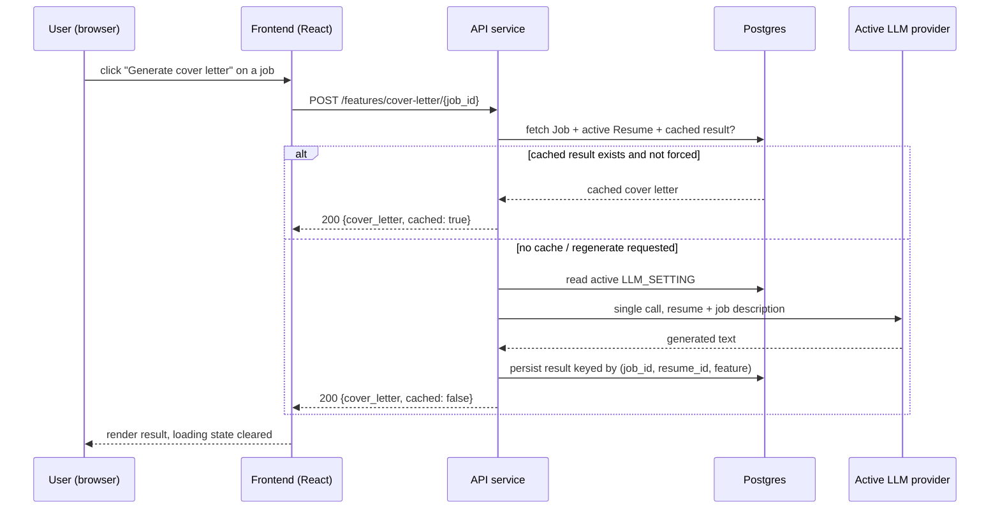
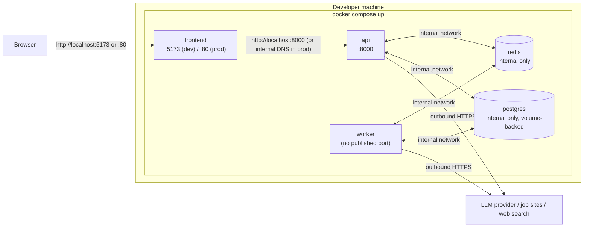
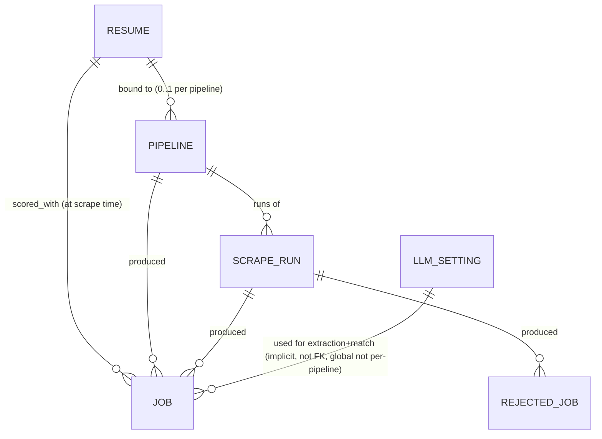

# Flow Diagrams — v2

Status: Draft v1
Companion docs: [functional-requirements.md](functional-requirements.md), [architecture.md](architecture.md), [system-design.md](system-design.md), [plan.md](plan.md)

## 1. End-to-end scrape → extract → filter → save → enrich

Key property this diagram is meant to make obvious: **nothing about persistence blocks on salary enrichment**, and **one batch's LLM failure doesn't stop the loop** — both are direct responses to v1 pain points (a monolithic pipeline run that either fully succeeded or left partial state, and a single-process design where a slow call stalled everything). A second, independent instance of this exact diagram runs for Pipeline Y (e.g. "Data Engineer," its own resume, its own thresholds) with no coupling to Pipeline X beyond the shared LLM provider concurrency cap (system-design.md §2.3).

## 2. On-demand feature request (cover letter, interview prep, etc.)

This stays synchronous by design (system-design.md is explicit that this is a deliberate choice, not an oversight): the user is actively waiting on one specific result for one job, so a request/response call with a client-side spinner is simpler than a queue+poll round trip and matches v1's existing UX.

## 3. Container / deployment view

Only `frontend` and `api` publish ports to the host; `postgres` and `redis` are reachable only inside the Compose network — closing off the class of problem this project hit directly during v1 debugging (an unrelated Docker container from a different project squatting on port 8000). Every port is `.env`-configurable per FR-9.3.

## 4. Data model relationships

See architecture.md §3.2 for the full ER diagram with fields. Relationship summary:

`LLM_SETTING` is linked implicitly (which model produced a job's fields is knowable from timing/logs, not a hard FK) — adding a hard FK later is a compatible, non-breaking schema change if audit-grade "which model scored this" tracking is ever needed. Note the asymmetry: `RESUME`/`PIPELINE` are explicitly multi (a "AI Engineer" resume/pipeline and a "Data Engineer" resume/pipeline coexist independently), while `LLM_SETTING` is deliberately kept singular (decisions log #8, system-design.md) — the redesign's "one resume per search, one LLM for everything" split is a real asymmetry, not an inconsistency.
